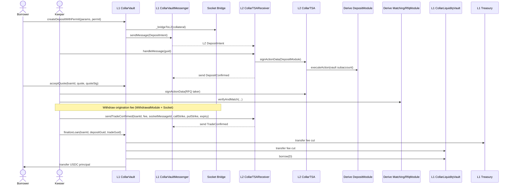
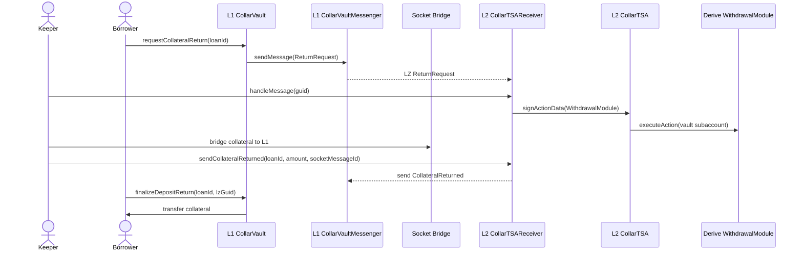
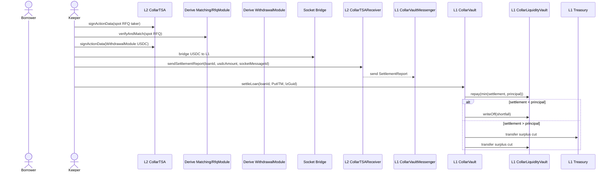
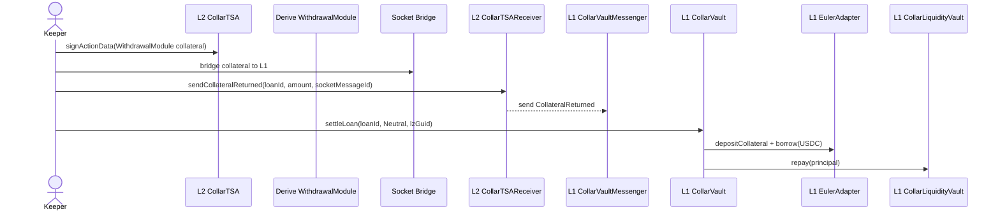
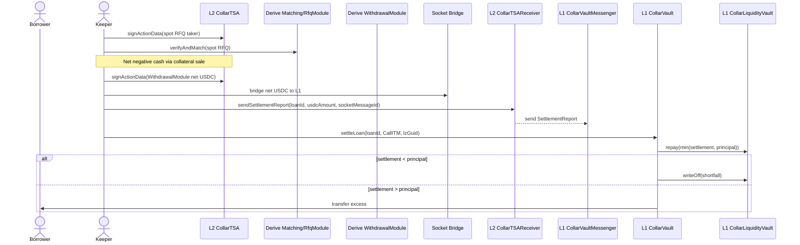

# CollarFi Protocol Technical Specification

Version 1.0 - Draft dated 6 Jan 2026

## 1. Overview

CollarFi is a DeFi lending protocol that issues zero-cost, fixed-maturity USDC loans against crypto collateral (major assets supported by Derive, e.g., WBTC, cbBTC, WETH, wstETH). Each loan is hedged by opening a collar on the Derive exchange: the protocol buys a put option to protect the loan principal and sells a call option to collect enough premium to cover the cost of capital, platform fees and (if necessary) the settlement drag. Upon maturity, three outcomes are possible:

1. Put ITM (underwater): the collateral's value is insufficient to repay the principal. The protocol sells the collateral, collects the put payoff and repays lenders.
2. Neutral corridor: both options expire OTM; the borrower's collateral is still worth at least the principal. The loan converts to a variable-rate loan backed by the same collateral in a money-market vault.
3. Call ITM (profit): the collateral appreciates above the call strike. The protocol sells the collateral, pays the call payoff to the option buyer (the market maker) and repays the principal; the borrower receives the upside beyond the call strike.

CollarFi uses Derive's vault architecture and fast bridge to manage the collateral and options on Derive L2 while keeping liquidity and accounting on Ethereum L1 (see Derive official docs: https://docs.derive.xyz/). Liquidity providers deposit USDC into a lending vault; idle funds are deployed into Euler V2 (EVK) for variable yield. Borrowers receive USDC loans; market makers quote call strikes; and an off-chain executor places orders on Derive.

This specification documents the smart contracts, off-chain components and flows necessary to implement CollarFi.

## 2. Entities and Components

| Entity/Component | Description |
| --- | --- |
| Borrower | Permissionless user who provides crypto collateral; receives a zero-cost loan; may convert into a variable-rate loan after neutral expiry. |
| Lender | Deposits USDC into an ERC-4626 vault on L1; earns Euler yield and premiums from collars. |
| Vault Contract (L1) | Smart contract controlling collateral, loans and settlement on L1. It does not sign Derive actions. |
| TSA Contract (L2) | `CollarTSA` on Derive L2; inherits `BaseOnChainSigningTSA`, owns the Derive subaccount, and signs actions via ERC-1271. |
| Vault Executor (off-chain) | Authorized signer that prepares and signs orders off-chain, posts them to Derive's API, monitors options positions and triggers settlement. |
| Liquidity Vault (USDC Pool) | ERC-4626 vault storing lender USDC. Integrates with Euler V2 for yield. Tracks available liquidity and active loans. |
| Euler Money Market | Lending market where USDC can be lent and borrowed at variable rates. |
| Derive Subaccount | A single subaccount on Derive L2 owned by the L2 TSA contract via ERC-1271. It holds deposits, open collar positions, and settlement flows. |
| Derive Deposit Module | Module that deposits ERC-20 tokens into a subaccount. Called by the executor using the L2 TSA signature via Derive's API. |
| Derive Withdrawal Module | Module that withdraws ERC-20 tokens from a subaccount back to L1. Called by the executor using the L2 TSA signature via Derive's API. |
| Derive Trade Module | Module that matches limit orders and executes trades (options purchases and sales). |
| Derive Fast Bridge | Socket/L2 messaging bridge used for sending USDC and collateral between L1 and L2 quickly. Bypasses the 7-day challenge period of the canonical OP bridge. |
| Market Maker (MM) | External participant quoting call strikes and premiums for the collar. Accepts the call leg of the options trade. |
| Keeper | Service that triggers settlement at maturity and monitors loan state transitions. |

## 3. Collateral and Bridging Flow

### 3.1 Collateral deposit (L1 -> L2)

When a borrower wants a loan, they first submit `createDepositWithPermit` on L1 with a Permit2 signature for the collateral and their desired loan parameters (collateral asset/amount, maturity, put strike, desired borrow amount). The vault pulls collateral (standard, non-rebasing ERC-20 only; use wrapped variants such as wstETH) via Permit2, sends it over the Socket SuperBridge to L2, and records a pending-deposit state. The keeper finalizes the loan later after L2 confirmations and quote acceptance.

Because RFQ execution on Derive requires collateral in the subaccount, the loan lifecycle is asynchronous: collateral must be confirmed on L2 before RFQs are requested/accepted, before the RFQ trade is executed, and before the loan is disbursed on L1.

To minimize trust assumptions, the vault sends a LayerZero message alongside the Socket bridge transfer containing the Socket `messageId` and deposit metadata (loanId, asset, amount, subaccountId). A dedicated L2 receiver stores the message and only signs a Deposit Module action once the Socket transfer is confirmed. The L2 receiver then sends a LayerZero `DepositConfirmed` acknowledgment (including the vault recipient, asset and amount) back to L1 so the keeper can finalize state without relying on an off-chain relayer.

Borrowers can cancel deposits directly. If the borrower declines all quotes or the RFQ cannot be executed after the deposit is bridged (e.g., quote expiry or failure to trade), the borrower initiates a return by calling `requestCollateralReturn(loanId)` on L1, which sends a `ReturnRequest` LayerZero message. The L2 receiver signs a Withdrawal Module action from the vault subaccount, and the executor bridges the collateral back to L1. The L2 receiver sends a `CollateralReturned` LayerZero message including the Socket `messageId` so L1 can finalize once the bridge completes. Because collateral shares a single subaccount with open positions, the L2 receiver MUST only sign the withdrawal when aggregate coverage and cash constraints remain satisfied: `baseBalance - amount >= shortCalls` and cash >= `maxNegCash` (as defined by the strategy contract / risk parameters).
To prevent races between loan creation, RFQ execution, and returns, a `ReturnRequest` is best-effort and **does not** cancel the loan on its own. The executor MAY still execute an RFQ taker action after a `ReturnRequest` if the return cannot be completed. The L2 receiver MUST only send **one** of `TradeConfirmed` or `CollateralReturned` for a given loan (no `ReturnRejected` message is sent). L1 finalization MUST enforce mutual exclusion: `finalizeDepositReturn` must revert if a trade was confirmed, and `finalizeLoan` must revert if collateral was returned.

### 3.2 Collateral withdrawal (L2 -> L1)

Upon loan maturity or variable-rate conversion, the vault executor uses the Withdrawal Module to withdraw collateral or USDC from the subaccount. The fast bridge is used to send funds back to the vault on L1. The vault contract waits for the bridged funds before updating liquidity balances.

LayerZero messages are used to relay withdrawal requests and settlement reports (including the Socket `messageId`) between L1 and L2. For withdrawals, L2 sends a `CollateralReturned` message once the L2->L1 Socket bridge is initiated so L1 can finalize state based on bridge confirmation instead of off-chain attestations. L1 finalization consumes these LayerZero messages and is executed via an L1 transaction (borrower or keeper pays gas).

### 3.3 Deposit/withdraw handlers

For convenience, the vault can implement wrappers that automatically call the deposit or withdrawal modules once the bridge transfer finalizes (see Derive official docs: https://docs.derive.xyz/).

## 4. Derive Vault Architecture

### 4.1 Smart-contract subaccount ownership

Derive uses smart-contract wallets to control subaccounts. The L2 TSA contract (`CollarTSA`) inherits `BaseOnChainSigningTSA`, which implements ERC-1271 signature validation. This allows off-chain signed orders to be validated on chain by Derive when settling trades. The TSA contract:

- Stores a set of authorized signers and submitters. Only the executor (signer) may sign order actions; only designated submitters may submit orders.
- Implements `isValidSignature(bytes32 hash, bytes signature)` to return the ERC-1271 magic value if the signature was produced by an authorized signer and corresponds to a known action (see Derive official docs: https://docs.derive.xyz/).
- Manages nonces and signed data to prevent replay.

### 4.2 Deposit Module

`DepositModule` allows the vault to deposit ERC-20 tokens into its subaccount. Key points:

- Requires one action per call; the action data encodes a `DepositData` struct specifying the amount, asset and whether to create a new subaccount.
- Transfers the deposit asset from the caller to the vault and approves the Derive asset contract.
- Calls the asset contract's deposit function to credit the subaccount.

### 4.3 Withdrawal Module

`WithdrawalModule` withdraws ERC-20 tokens from a subaccount:

- Requires one action with `WithdrawalData` (asset and amount). The subaccount ID must be non-zero.
- Checks the nonce and calls `IERC20BasedAsset.withdraw` to withdraw the specified amount from the subaccount to the owner.
- The TSA only allows withdrawals of the wrapped collateral asset and the cash asset (USDC). Cash withdrawals are limited to the available positive cash balance (no additional borrowing via withdrawal).

### 4.4 Trade Module

`TradeModule` executes limit orders:

- The `executeAction` function processes a batch of `VerifiedAction` objects: the taker (the vault) followed by one or more makers (MMs). It verifies order nonces, decodes order data and trade data, updates oracles if needed, and batches asset transfers. It charges taker fees and matches orders via `_fillLimitOrder`.
- `_fillLimitOrder` enforces price slippage limits, ensures the fill does not exceed the maker's limit or the vault's own maximum, updates filled amounts and adds asset transfers for quote and base token flows.

### 4.5 Strategy contracts

Derive provides various strategy contracts (e.g., CCTSA for covered calls, PPTSA for put spreads). Each extends `CollateralManagementTSA`, which includes deposit/withdraw verification and risk parameters. CollarFi can implement its own strategy contract by inheriting from `CollateralManagementTSA` and overriding `_verifyAction` to enforce conditions specific to zero-cost collars (e.g., strike bounds, maturity windows, option limit prices). The strategy contract may also set management and performance fees for the vault (see Derive docs).

## 5. Loan Lifecycle and Scenarios

### 5.1 Zero-cost loan origination

**User input**: Borrower selects collateral asset `Q`, amount and maturity `t` (must match a Derive-defined expiry). They choose a put strike `K_p` (from a tier) and request to borrow USDC amount `D`.

**RFQ (off-chain)**: The vault executor queries market makers to provide quotes for the call strike `K_c` such that the call premium minus the put premium equals or exceeds the target cost of capital (Euler rate + risk premium and, if needed, settlement drag). After the L2 deposit is confirmed, the borrower accepts a quote off-chain; quotes are EIP-712 signed and verified on-chain in `acceptQuote`. The quote struct includes `loanId` to bind the quote to the pending deposit. Strike tiers and valid Derive maturities are enforced by the executor; the vault does not maintain an on-chain tier list or expiry whitelist.

**Collateral deposit (L1 -> L2)**: The borrower calls `createDepositWithPermit` on L1 with a Permit2 signature for the collateral and their desired loan parameters (collateral asset/amount, maturity, put strike, desired borrow amount). The vault pulls the collateral via Permit2, calls the fast bridge to send it to Derive L2 and waits for confirmation. The loan is placed in a pending-deposit state until L2 confirmation and Derive subaccount deposit finalize. No RFQ quote is validated at this step.

**Subaccount deposit**: After the collateral arrives on L2, the executor calls the Deposit Module with action data (asset: `Q`, amount: `Q`, `managerForNewAccount: true` if new subaccount). This deposits the collateral into the vault subaccount.

**Quote acceptance (L1)**: After the L2 deposit is confirmed, the borrower calls `acceptQuote(loanId, quote, quoteSig)` on L1. The vault validates the EIP-712 quote signature, verifies the quote parameters match the recorded deposit intent (collateral asset/amount, maturity, put strike, desired borrow amount), and commits principal. The quote struct includes `loanId` to bind the quote to the pending deposit. Once a quote is accepted, the borrower **cannot** request a return until `quoteExpiry` has passed.

**Open collar**: The executor signs and submits an RFQ taker action on Derive:

- Buy a put with strike `K_p` and maturity `t`.
- Sell a call with strike `K_c` and maturity `t`.

No partial fills are allowed; the orders must be fully matched. The trade must conform to risk limits (e.g., delta within bounds) enforced by the strategy contract. Derive matches the order against market makers and settles the trade, crediting or debiting the subaccount accordingly.

After the RFQ taker action is executed from the vault subaccount, the L2 receiver verifies `RfqModule.usedNonces[vaultTSA][takerNonce] == true` and sends a `TradeConfirmed` LayerZero message back to L1. The taker nonce is set to the quote nonce so each RFQ attempt has a unique confirmation. The `TradeConfirmed` message includes the USDC fee amount bridged to L1 and the Socket `messageId` for that fee withdrawal.

**Loan disbursement**: On L1, `finalizeLoan` (keeper/executor) consumes the `DepositConfirmed` LayerZero message for the matching `loanId` (recipient must be the vault, asset/amount must match) and consumes a `TradeConfirmed` LayerZero message that includes the `quoteHash`, `takerNonce` (must match the quote nonce), USDC fee amount, and the Socket `messageId` for the fee withdrawal. The vault computes the expected origination fee from `originationFeeApr` and loan duration and requires it to match the bridged amount. The fee is split between the liquidity vault and treasury using `treasuryBps` and paid at loan creation. After fee distribution, the vault contract withdraws USDC from the liquidity vault (Euler pool) equal to `D` and transfers it to the borrower. It records loan state `ACTIVE_ZERO_COST`, storing a global sequential `loanId`, `Q`, `K_p`, `K_c`, `t`, principal `D` and the vault subaccount ID.

**Return before trade**: If the RFQ is rejected, expires, cannot be executed after the collateral deposit, or the borrower declines all quotes, the borrower calls `requestCollateralReturn(loanId)` on L1. The vault sends a `ReturnRequest` LayerZero message to L2, and the receiver signs a Withdrawal Module action from the vault subaccount if `baseBalance - amount >= shortCalls` and cash >= `maxNegCash`. After the collateral is bridged back to L1, the L2 receiver sends a `CollateralReturned` message; an L1 transaction consumes it, clears the pending deposit, and transfers the collateral back to the borrower. A return request is **best-effort** and does not cancel the loan until `CollateralReturned` is received. If a quote was accepted, the borrower cannot request a return until the quote expires. Returns and trade confirmation are mutually exclusive at the message level: the L2 receiver must send at most one of `TradeConfirmed` or `CollateralReturned` for a loan; the L1 vault must revert `finalizeDepositReturn` if `TradeConfirmed` was handled, and must revert `finalizeLoan` if `CollateralReturned` was handled. No variable loan is opened for returned deposits, and subsequent loan creation with that pending deposit is prevented.

### 5.2 Maturity settlement

At maturity `t`, the executor (or a keeper) settles the collar position on Derive and triggers one of three outcomes. `S_t` is Derive's official expiry settlement price at maturity.

#### Outcome 1: Put ITM / Underwater (`S_t < K_p`)

- Executor requests a spot RFQ on Derive to sell the collateral to USDC. RFQs are full-fill only; the executor sets a `minAmountOut` and retries with a new RFQ if needed.
- Spot collateral sales are executed via the RFQ module only; order-book spot trades are not used.
- The RFQ is executed on Derive; collateral is sold to USDC before any bridging.
- All USDC proceeds (including the put payoff) are withdrawn via the Withdrawal Module. The fast bridge is used to send funds back to L1.
- On L1, the vault contract repays the principal `D` to the lending pool. If proceeds are below `D`, the shortfall is written off against the liquidity vault. If proceeds exceed `D`, the excess is distributed between the liquidity vault and protocol treasury according to a governance-configurable split. The loan state becomes `CLOSED` after bridged funds arrive.

#### Outcome 2: Neutral corridor (`K_p <= S_t <= K_c`)

- Both options expire OTM. The collateral remains on Derive and is not encumbered.
- The vault contract bridges the collateral back to L1 via the fast bridge. The L2 receiver sends a `CollateralReturned` message with the Socket `messageId` so L1 can finalize the conversion once the bridge completes.
- On L1, the collateral is deposited into the Euler V2 market as standard collateral. The borrower may immediately borrow USDC up to a variable rate (subject to Euler's LTV). This variable-rate loan repays the original principal `D`, converting the zero-cost loan to a `VARIABLE` loan.
- The borrower's position remains liquidatable by Euler if the collateral price drops.

#### Outcome 3: Call ITM / Take profit (`S_t > K_c`)

- Derive's cash system allows negative USDC balances; the short call settlement can create a negative cash balance (i.e., a USDC borrow) in the vault subaccount.
- Executor requests a spot RFQ on Derive to sell the collateral to USDC. RFQs are full-fill only; the executor sets a `minAmountOut` and retries with a new RFQ if needed.
- Spot collateral sales are executed via the RFQ module only; order-book spot trades are not used.
- The RFQ is executed on Derive; the resulting cash balance nets against any negative USDC balance. There is no explicit repay call; repayment occurs by netting the cash balance back to >= 0.
- Only the net positive USDC balance (after the call payoff and any negative cash balance are covered) is withdrawn via the Withdrawal Module and bridged to L1.
- On L1, the vault repays principal `D` to the lending pool from the bridged USDC. If the net bridged amount is insufficient to repay `D`, the protocol backstops the shortfall with L1 liquidity; the borrower receives zero in this case.
- If the net bridged amount exceeds `D`, the excess belongs to the borrower. The vault contract does not make optimistic payouts; the loan state becomes `CLOSED` after bridged funds arrive.

### 5.3 Variable-rate conversion (neutral corridor)

Since the fast bridge is available for all fund movement, the protocol can remove the dAsset receipts previously proposed for slow bridging. Instead:

- Collateral release: Upon neutral maturity, the collateral is unencumbered on Derive. The executor uses the Withdrawal Module to withdraw the collateral to L2 and bridges it back to L1.
- Euler deposit: The collateral is deposited into a standard Euler V2 market on L1. The borrower borrows USDC up to the maximum LTV permitted by Euler. The borrowed USDC repays the zero-cost loan principal.
- Accounting: The loan state changes from `ACTIVE_ZERO_COST` to `ACTIVE_VARIABLE`. Interest accrues at the Euler variable rate. When the borrower repays, the collateral is returned.

### 5.4 Rolling a variable loan into a new collar

Rolling is not supported. If a borrower wants a new collar after converting to a variable loan, they must repay the variable loan, withdraw the collateral from Euler, and initiate a new collar loan via the standard origination flow.

## 6. Smart Contracts and Interactions

### 6.1 Vault contract (L1)

Does not sign Derive actions. All Derive signing and subaccount ownership live in the L2 TSA contract.

All dependent smart contracts should be placed under the `lib/` folder.

Maintains L1 loan records, collateral amounts, and maturity schedules. It relies on L2 messages for Derive execution confirmation.

Provides functions:

- `createDepositWithPermit(params, permit, permitSig)` - permissionless; records the borrower's desired loan parameters, pulls collateral via Permit2, calls the bridge, and records a pending deposit awaiting L2 confirmation.
- `acceptQuote(loanId, quote, quoteSig)` - permissionless; validates the quote (including `loanId` binding), enforces the total committed principal cap (if set), records the pending quote, and commits principal.
- `requestCollateralReturn(loanId)` - borrower; sends a `ReturnRequest` message to L2 to initiate withdrawal from the vault subaccount (subject to shared-subaccount safety checks). The request is best-effort and does **not** cancel the loan until `CollateralReturned` is received. If a quote was accepted, this call must revert until `quoteExpiry` has passed.
- `finalizeLoan(loanId, depositGuid, tradeGuid)` - keeper/executor; consumes `DepositConfirmed` and `TradeConfirmed` messages to open the loan and disburse USDC. Must revert if a return was requested/processed for the loan.
- `finalizeDepositReturn(loanId, lzGuid)` - permissionless; consumes the L2 `CollateralReturned` message for a pending deposit and transfers collateral back to the borrower. Must revert if a trade was confirmed for the loan. TODO: decide what to do in case the call reverts as the collateral will be stuck in the `CollarVault`.
- `settleLoan(loanId)` - restricted to keeper/executor roles; closes positions and initiates bridging of proceeds. Reverts on-chain if `block.timestamp < maturity`.
- `convertToVariable(loanId)` - restricted to keeper/executor roles; bridges collateral back and interacts with Euler. Reverts on-chain if `block.timestamp < maturity`.
- `setMaxTotalPrincipal(max)` - parameter role; caps the total committed principal (pending + active zero-cost loans) to scale TVL gradually.

Exposes events for state changes (`LoanCreated`, `LoanSettled`, etc.).

### 6.2 Off-chain executor

Runs a secure service that:

- Generates `SignedAction` objects (deposit, trade, withdraw) and signs them with the vault's authorized signer.
- Posts actions to Derive's API (e.g., `/post_private-order` for trades).
- Submits trades via the Trade Module, matching orders with market makers.
- Monitors oracle prices and maturity times; triggers settlement via the vault contract.
- Monitors pending collateral deposits, confirms L2 subaccount credit before requesting RFQs or executing trades, coordinates L2 withdrawal execution after borrower-initiated returns, and ensures only one of `TradeConfirmed` or `CollateralReturned` is emitted per loan.
- Interacts with the fast bridge and deposit/withdraw handlers.

### 6.3 Liquidity vault (USDC pool)

Implements ERC-4626 for lenders. Idle USDC is deposited into Euler V2; variable-rate earnings accrue to lenders.

Tracks two balances: `availableLiquidity` and `activeLoans`. Lenders can withdraw up to available liquidity; settlement proceeds are reflected once bridged to L1.

Exposes functions `borrow(uint256 amount)` and `repay(uint256 amount)` for the vault contract.

May cap the total notional per maturity bucket to manage risk.

### 6.4 Euler integration

On neutral maturity, the vault contract deposits collateral into Euler V2 as collateral. It then borrows USDC; interest accrues at the variable rate.

When the borrower repays, the vault contract returns the collateral to the borrower and repays the Euler debt.

### 6.5 Bridging contracts

The vault must integrate with the Socket SuperBridge fast bridge on L1. Daily limits and connector fees apply (see Derive/Socket docs).

Events on the bridge are monitored by the deposit/withdraw handlers to trigger module calls on L2.

### 6.6 Pricing and RFQ service

A separate off-chain module handles quoting. It queries MMs for call strike quotes given the borrower's requested principal and put strike. It ensures the call premium minus put premium meets the target cost of capital (Euler rate + risk premium). Settlement drag is negligible due to fast bridging.

The RFQ module produces EIP-712 signed quotes that are verified on-chain in `acceptQuote`. The quote struct includes `loanId` to bind the quote to a pending deposit.

### 6.7 Keeper and monitoring

A keeper service must monitor block timestamps and call `settleLoan` once a loan's maturity is reached. It ensures the Derive position is closed and bridging initiated. Settlement uses Derive's official expiry settlement price at maturity (`S_t`).

Monitors for situations such as the bridge being down or fast withdrawal limits reached; in such cases it may delay new originations or enforce variable-rate conversion.

## 7. Security and Risk Controls

- Signature authenticity: Only authorized signers can sign Derive actions; signatures are validated via ERC-1271 in the L2 TSA contract (see Derive official docs: https://docs.derive.xyz/).
- Replay protection: Nonces are stored per action; signed data cannot be reused or submitted by unauthorized parties.
- Market risk parameters: The strategy contract may set strike ranges, time-to-expiry bounds, and slippage tolerances. The vault must ensure the collateral covers all short calls and that no deposit/withdraw actions leave the subaccount insolvent.
- Origination cap: The L1 vault enforces a maximum total committed principal (pending + active zero-cost loans) to limit aggregate exposure.
- Bridge limits: The fast bridge has daily deposit/withdraw limits (see Derive official docs: https://docs.derive.xyz/). The vault should track cumulative amounts and throttle operations if limits are approached.
- Liquidation risk: Variable-rate loans on Euler are subject to liquidation. The protocol relies on Euler's liquidation mechanisms rather than triggering forced sales.
- Withdrawal race conditions: Because bridging is asynchronous, ensure that bridging calls are idempotent and that funds are not double-counted.
- Oracle reliability: Use multiple price feeds or Derive's TWAP to determine settlement prices. Validate oracle data in the off-chain executor.
- Settlement amount trust: The executor is trusted to compute and report the final settlement amount (including collateral sale proceeds) in `SettlementReport`.
- Derive cash balance risk: Call ITM settlement may result in a negative USDC balance on Derive; ensure the collateral sale fully nets the negative balance before bridging, and account for potential L1 backstop usage if net proceeds are below principal.
- Socket message ID trust: `TradeConfirmed` includes a Socket `messageId` provided by the L2 executor; the system trusts the executor to supply the correct bridge message ID and amount for the origination fee withdrawal.
- Aggregate coverage withdrawals: Withdrawals from the shared vault subaccount must only be signed when `baseBalance - amount >= shortCalls` and cash stays above `maxNegCash`. This is an aggregate (not per-loan) invariant and relies on correct executor operation.
- Return/trade mutual exclusion: A `ReturnRequest` is best-effort and does not cancel the loan on its own. The L2 receiver must emit **at most one** of `TradeConfirmed` or `CollateralReturned` for a loan. L1 must reject `finalizeDepositReturn` if `TradeConfirmed` was handled, and must reject `finalizeLoan` if `CollateralReturned` was handled.
- Role-based parameter changes: Strike bounds, slippage tolerances, market allowlists and other risk parameters are adjustable by a role controlled by a multisig; governance modules may replace this role later.
- Emergency controls: The protocol supports emergency controls to pause new loans and settlement.

## 8. Deployment and Configuration

- Deploy the L2 TSA contract inheriting from `BaseOnChainSigningTSA`. Configure authorized signers/submitters, derivative asset addresses, and the vault subaccount used for deposits, trades, and settlement.
- Deploy the liquidity vault (ERC-4626), integrate with Euler V2 and configure deposit/withdraw functions for the vault contract.
- Set up the fast bridge by referencing the Derive bridge contract addresses for each asset and granting necessary approvals.
- Deploy the strategy contract if risk checks or fee schedules are custom. Otherwise, reuse Derive's existing modules.
- Initialize the vault executor with credentials for Derive's API and keys for signing actions.
- Configure keeper services to monitor maturities, bridging events and Euler liquidations.
- Establish RFQ feeds with market makers to obtain call strike quotes and option premiums.
- Configure governance/owner roles as a multisig; later upgrades to a governance module are permitted for parameter updates.

## 9. Clarifications and TBDs

The following items are not yet specified and require clarification before implementation:

- Trade verification: implemented via `TradeConfirmed` LZ message after `RfqModule.usedNonces` is set for the taker nonce (quote nonce).
- Shared subaccount accounting: per-loan balance checks are not possible with current Derive action formats. Review whether aggregated withdrawals introduce an attack vector and whether a protocol-level withdrawal pause or stricter withdrawal gating is required (including cancellation/return flows).
- On-chain bounds: strikes and maturities are enforced off-chain by the executor; no on-chain strike/maturity whitelist is required.
- Maturity enforcement: whether Derive-defined maturities are enforced on-chain or only by the executor.
- Origination fee timing: fee is annualized, funded from net option premium, and paid at loan creation after the fee withdrawal is bridged to L1.

## 10. Conclusion

By leveraging Derive's vault architecture and fast bridge, CollarFi can implement a non-custodial lending protocol that hedges collateralized loans with zero-cost collars. An L2 TSA contract owns the Derive subaccount, and the L1 vault coordinates collateral and settlement via rapid bridging. When options expire neutrally, the collateral is bridged back and deposited into Euler V2 to continue earning yield via a variable-rate loan. Careful configuration of signers, nonces, bridge limits and risk parameters ensures solvency and security for lenders and borrowers alike.
